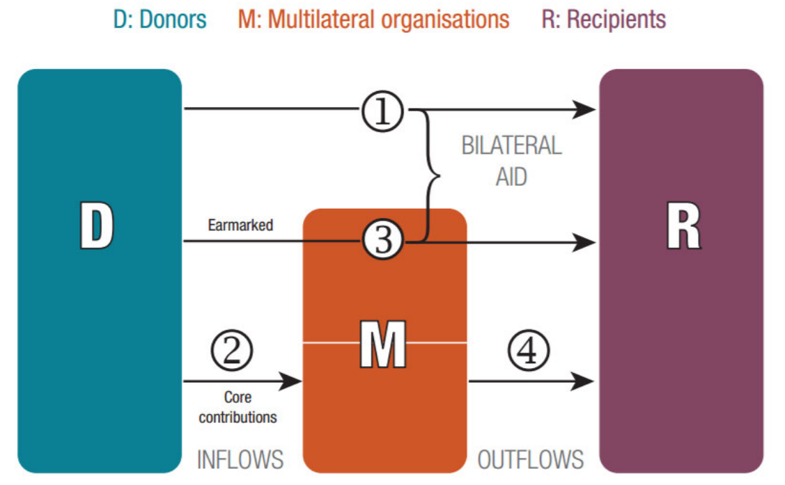

#  Monitoring funding to statistics with accuracy

This section provides information on how to monitor support to statistics and how the data of the 
PRESS, which is also used  for  reporting SDG indicator 17.19.1  ("Dollar Value of all  resources made 
available to strengthen statistical capacity in developing countries"), is generated.  

Prior to PRESS 2018, the PRESS only focused on borrowing countries of the International Development 
Association.^[Eligibility for IDA support depends first and foremost on a country’s relative poverty, which is defined as GNI per capita 
below an established threshold and updated annually ($1,185 in the fiscal year 2021). IDA also supports some countries, 
including several small island economies, that are above the operational cut‐off but lack the required creditworthiness to 
borrow from the International Bank for Reconstruction and Development (IBRD). For more information, see: http://ida.worldbank.org/about/borrowing‐countries]
Since 2018, the PRESS covers the commitments received by all countries throughout the 
report  to  align  the  findings  with  the  SDG  indicator  17.19.1:  "Dollar  value  of  all  resources  made 
available to strengthen statistical capacity in developing countries". Commitments were used as the 
main measurement instead of disbursements from the beginning of PRESS in 2006, when commitment 
data  entries  were  made  available  more  consistently.  See  section \@ref(estimating-using-CRS)  for  a  discussion  on  using commitments vs disbursements in detail. 

The PRESS aims to provide a full picture of international support to statistics. To achieve this goal, it 
mainly takes advantage of two data sources:


## OECD's Creditor Reporting System (CRS)

The Organisation for Economic Co‐operation and Development (OECD)’s Creditor Reporting System
(CRS) records data from OECD Development Assistance Committee (DAC) members (donors) and some
non‐DAC donors. This provides a comprehensive account of Official Development Assistance (ODA).
Donors report to the CRS using specific codes for the sectors targeted by their aid activity. Statistical
Capacity Building (SCB) is designated by the sector code 16062.^[Until 2019, this purpose was vaguely defined as "Both in national statistical offices and any other government ministries". However, after a successful campaign to improve the description, this purpose is now defined as “All statistical activities, such as data collection, processing, dissemination and analysis; support to development and management of official statistics
including demographic, social, economic, environmental, and multi‐sectoral statistics; statistical quality frameworks;
development of human and technological resources for statistics, investments in data innovation."]
Each activity reported in CRS can only be assigned with one of the over 100 purpose codes.^[In recent years, CRS reporters can also assign multiple voluntary purpose codes to the same project. Code 16062 is not a voluntary code. See the CRS code list for more information: https://www.oecd.org/dac/financing‐sustainable‐development/development‐finance‐standards/dacandcrscodelists.h] 
While CRS is one of the most reliable and comprehensive databases that accounts for aid flows, there are some concerns that need to be
addressed while compiling support for data and statistics, such as: the cross‐cutting nature of projects
with statistical components, limited reporter knowledge about the code, the assignment of some ODA
for data and statistics under other codes, lack of granularity in reporting, etc. These issues are covered
in detail in PARIS (2019). PARIS21 is seeking to reduce this usually downward bias using a text analysis
methodology section \@ref(machine-learning).

The CRS identifies a project donor by looking at the source of the funding. Countries are identified as
donors if the flow is directly between them and the recipient country (type 1 in Fig. \@ref(fig:funding-flows)), or if
the flow is earmarked for a certain project and channeled through multilateral organisations (type 3
in Fig. \@ref(fig:funding-flows)). If a project is funded by un‐earmarked core contributions to multilateral
organisations, the donors are marked as the multilateral organisations (types 2 and 4 in Fig. \@ref(fig:funding-flows)).

```{r funding-flows, echo=FALSE, fig.align="center", fig.cap = "Flow of official aid in CRS.", }

```


## PARIS21's annual online survey {#P21-online-survey}

The PARIS21 Secretariat supplements the data from the CRS with an annual online survey that is
completed by a global network of respondents, mostly non‐DAC donors. The survey covers a subset
of the variables collected in the CRS, as well as some additional variables specific to data and statistics.
Responding to the online survey is voluntary and offers an opportunity for respondents to share
information about their statistical activities. Respondents include non‐DAC members, including non‐
DAC donor countries, multilateral organisations, regional statistical training institutes, and other
philanthropic organisations. The percentage of these projects in the final PRESS database has
decreased in recent years, as many multilateral organisations have improved the granularity of their
reporting to the CRS, making these data equally useful as data collected from the PRESS survey. To
reduce the burden on donors, these multilateral organisations are no longer required to fill in the
PRESS survey.
