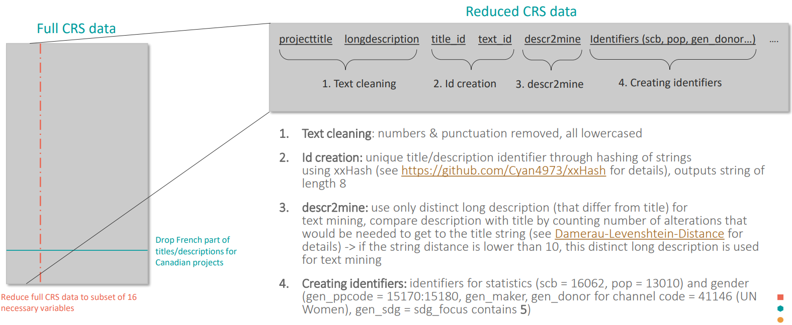
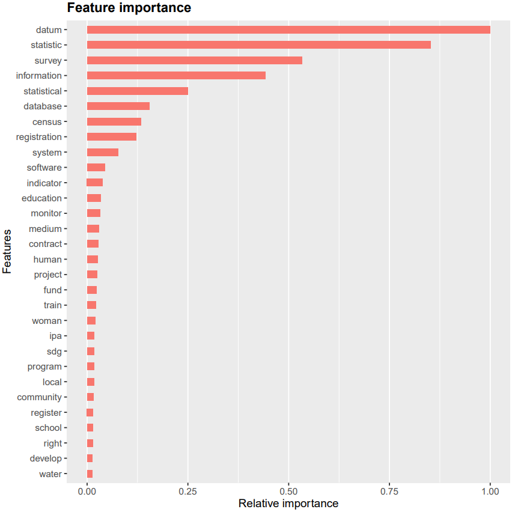

# Identifying data and statistical projects using machine learning {#machine-learning}

The developed method to identify data and statistical projects is based on a two-step procedure that analyzes project titles in the first step by detecting pertinent keyword (**A**) and evaluates project’s detailed descriptions using a machine learning approach (**B**).

## Reading the CRS data

After downloading all .txt files for the years 2006 - 2020 from the official OECD [data base](https://stats.oecd.org/DownloadFiles.aspx?DatasetCode=CRS1), the fully merged data set is stored.


## Preparing the data 

Here, the process of preparing the data is outlined (see Fig. \@ref(fig:data-preparation-CRS) for a comprehensive overview).

1. **Reducing the full CRS data set**

    A known characteristic of Canadian reporting in the CRS data base is that both project titles and long descriptions^[Originally both short and long description present in CRS data; from now one referred to as description] are reported in both official languages in the format "Englisch/French". To avoid misclassification and misidentification due to the presence of both languages, the French part was dropped. Additionally, the full data set was reduced to 16 necessary variables to avoid heavy computational load of the full 96-variable data set. 

2.	**Adding text identifiers**

    i. *Text cleaning*: First of all, the titles and descriptions were lowercased and cleaned by removing all numbers and punctuation signs in an effort to prepare the text for the creation of unique text identifiers. This is done to avoid unnecessary inclusion of projects that differ only slightly (e.g. by a number or comma).  
    
        ```{r title-cleaning, results="asis", eval = FALSE}
        library(tm)
        
        # Define function to clean titles
        clean_titles <- function(title){
          title <- title %>% 
            removeNumbers %>%
            removePunctuation(preserve_intra_word_dashes = TRUE) %>%
            tolower
          return(title)
        }
        
        df_crs <- df_crs_raw %>%
          mutate(projecttitle = clean_titles(projecttitle),
                 shortdescription = clean_titles(shortdescription),
                 longdescription = clean_titles(longdescription))
        ```
    <br />
    
    ii.	*Id creation*: Each project title and description is given a specific id in order to be able to analyze only distinct titles and descriptions later on. These were created using a well-known hashing algorithm called “xxHash” that is reasonably fast and exhibits very good collision properties (see https://github.com/Cyan4973/xxHash). 
    
        ```{r id-creation, results="asis", eval = FALSE}
        library(digest)
          
        df_crs <- df_crs %>%
          rowwise() %>% # use rowwise operations since digest concatenates vector of strings
          mutate(text_id = digest::digest(longdescription, algo = "xxhash32")) %>% # add text_id as hashed longdesription
        ```
      <br />
  
    iii. *descr2mine*: Due to lazy reporting, frequently the descriptions differ only marginally from the project titles. This would pose a problem to the previously outlined twofold procedure since descriptions that are identical to the project titles would be analyzed twice. Therefore, only distinct descriptions are used which are identified using the [Damerau-Levenshtein-Distance](https://en.wikipedia.org/wiki/Damerau%E2%80%93Levenshtein_distance) that counts how many alterations it would take to align both texts. The threshold for the maximal distance was set to 10 since this includes spelling mistakes, as well as one-word deviations (e.g. Output: …). 
    
        ```{r descr2mine, results="asis", eval = FALSE}
        library(stringdist)
                
        # Max string distance underneath which strings can be considered the same/differing just by a word
        max_string_dist <- 10 
        df_crs <- df_crs %>%
          mutate(descr2mine = ifelse(stringdist(projecttitle, longdescription) < max_string_dist | str_count(longdescription) < 3, 
                                     NA, 
                                     longdescription))
        ```
      <br />
  
    iv. *Crating identifiers*: The CRS data set contains information about purpose of the funding flow in form of the purpose code, as well as other valuable information in other markers such as the gender marker (add link to resource) or the certain channel codes (41146 for UN Women). Table 1 lists all added identifiers. 
    
        ```{r identifier, results="asis", eval = FALSE}
        df_crs <- df_crs %>%
          mutate(scb = ifelse(purposecode == 16062, 1, 0), # Statistical capcity building identifier
                 pop = ifelse(purposecode == 13010, 1, 0), # population policy identifier
                 gen_ppcode = ifelse(purposecode %in% c(15170:15180), 1, 0), # add gender purpose code identifier
                 gen_marker = ifelse(gender == 1 & !is.na(gender), 1, 0), # add gender marker (0 - no gender, 1 - primary purpose, 2 - secondary)
                 gen_donor = ifelse(channelcode == 41146, 1, 0), # all projects from UN Women
                 gen_sdg = str_detect(sdgfocus, "^5|,5")) # SDG 5: Gender equality
        ```
      <br />
    
  
```{r data-preparation-CRS, echo=FALSE, fig.align="center", fig.cap = "Diagram of the data preparation process.", }

```

## **A**: Title pattern matching

In the following, the process of matching pertinent keywords in project titles is outlined (see Fig. \@ref(fig:title-pattern-matching) for a comprehensive overview).

1. **Preparing the data**

    In the first step, the language of both title and description is detected using [Google’s Compact Language detector 2](https://github.com/CLD2Owners/cld2) (CLD2). It can detect 83 different languages and exceeds similar language detection engines by as much as 10x in speed. Analyzing the language distribution is crucial to a refined classification since text in every language has to be treated differently, using different keywords for the subsequent title pattern matching and fitting a different machine learning model later on. Therefore, the procedure was applied to projects in English, French, Spanish and German since these make up the majority of detected languages. This was implemented by selecting only projects with combinations of (title_language, long_language) in (en, fr, es, de, NA) x (en, fr, es, de, NA) while excluding the (NA, NA) combination. This combination was excluded since CLD2 in a vast majority of cases detects NA if the text is very short or nonsensical.

    To give an overview how many projects are analyzed using this method, this approach encompasses 3.145.387 (90.6%) projects while 23.4020 	(6.7%) were excluded for being (NA, NA) projects. That leaves 90241 (2.6%) projects that were excluded because they were either wrongly detected or belong to some minor reporting languages (e.g. Norwegian, Portuguese or Polish with a significant fraction within the 2.6% of excluded projects).  

    In the second step, duplicated project titles were dropped to analyze these titles only once during the title pattern matching procedure which again reduced computation time.

```{r title-matching-language, results="asis", eval = FALSE, indent = '    '}
# All languages to include in classification - options: en, fr, es, de
languages <- c("en", "fr", "es", "de")
        
# Add unique title id and detect language of title and long description
df_crs <- df_crs %>%
  mutate(projecttitle_lower = tolower(projecttitle)) %>%
  rowwise() %>% # use rowwise operations since digest concatenates vector of strings
  mutate(title_id = digest::digest(projecttitle_lower, algo = "xxhash32")) %>% # create title id to drop duplicated titles later
  ungroup() %>%
  mutate(title_language = cld2::detect_language(projecttitle)) %>%
  mutate(long_language = cld2::detect_language(longdescription))
        
# Use only projects in en, fr, es and de
df_crs <- df_crs %>%
  filter(title_language %in% c(languages, NA) & long_language %in% c(languages,NA)) %>%
  filter(!is.na(title_language) | !is.na(long_language)) # omit projects with both languages NA 
        
# Select necessary columns and drop projects with duplicated title ids 
df_crs <- df_crs %>%
  select(title_id, projecttitle, projecttitle_lower, longdescription, title_language, long_language) %>%
  filter(!duplicated(title_id))
```
        
      <br />

2. **Title pattern matching**

    i. *Clean and lemmatize keyword lists*: For the treatment of the minority languages (French, Spanish and German), the English keyword list for statistics was translated by experts working in the field of official statistics. It contains many aspects of official development assistance in statistics and can be found in Appendix 1. The keywords therein are chosen in a way that it is almost certain that a project is at least partly related to statistics if its title contains one of the keywords. The same was done for the English list of acronyms which can differ in other foreign languages. Together with the list for mining projects, the keyword lists were cleaned and lemmatized to guarantee that they will be matched to cleaned and lemmatized words occurring in project titles. 
    
        ```{r clean-lemmatize-keywords, results="asis", eval = FALSE}
        # list_keywords_stat, list_acronyms and demining_small_arms previously loaded
        
        # Define lemmatization function
        clean_and_lemmatize <- function (string, language = "en"){
          string <- string %>% 
            tolower %>% 
            removeWords("'s") %>% # remove possesive s so that plural nouns get lemmatized correctly, e.g. "women's"
            removeNumbers() %>%
            removePunctuation(preserve_intra_word_dashes = TRUE) %>%
            stripWhitespace %>% 
            removeWords(c(stopwords('english'))) %>% 
            removeWords(c(stopwords(source = "smart")[!stopwords(source = "smart") %in% "use"])) %>% # exclude "use" from smart stopwords 
            lemmatize_strings()
        }
        
        # Lemmatization for "en"
        list_keywords_stat <- clean_and_lemmatize(list_keywords_stat, language = lang)
        demining_small_arms <- clean_and_lemmatize(demining_small_arms, language = lang)
        
        # Stemming for minority languages "fr", "es" and "de"
        list_keywords_stat <- stem_and_concatenate(list_keywords_stat, language = lang)
        demining_small_arms <- stem_and_concatenate(demining_small_arms, language = lang)
        ```
      <br />
    
    ii.	*Clean and lemmatize titles*: Cleaning of project titles was achieved by removing numbers, punctuation and so called “stopwords” (e.g. “and”, “the”, “for”) since they don’t contain information towards the classification. Subsequently, words were lemmatized meaning to reduce different forms of a word to its lemma (e.g. “women”, “woman’s”, “woman” -> “woman”). This is very important to guarantee that all various versions are found during the title pattern search. For minority languages however, stemming is used instead of lemmatization since no good lemmatization implementation was available.
    
        ```{r cl-lemma-titles, results="asis", eval = FALSE}
        df_crs <- df_crs %>%
          mutate(projecttitle_clean = ifelse(title_language == lang & !is.na(title_language), 
                                             clean_and_lemmatize(projecttitle_lower, language = lang),
                                             projecttitle_clean)) %>%        
        ```
      <br />

    iii. *Keyword detection*: For every language, the project title was analyzed whether it contains one of the statistical keywords or acronyms. 
    
          ```{r keyword-detection, results="asis", eval = FALSE}
          # Create regex for searching titles 
          list_keywords_stat <- paste0(" ", paste(list_keywords_stat, collapse = " | ")," |^", # words with whitespaces
                                      paste(list_keywords_stat, collapse = " |^")," | ", # beginning of string
                                      paste(list_keywords_stat, collapse = "$| "), "$") # end of string
          
          demining_small_arms <- paste0(" ", paste(demining_small_arms, collapse = " | ")," |^", 
                                    paste(demining_small_arms, collapse = " |^")," | ", # beginning of string
                                    paste(demining_small_arms, collapse = "$| "), "$") # end of string
                                
          # Detect stat, acronyms and mining 
          df_crs <- df_crs %>%
            mutate(match_stat = ifelse(title_language == lang | is.na(title_language), 
                                       str_detect(projecttitle_clean, list_keywords_stat), 
                                       match_stat),
                   mining = ifelse(title_language == lang | is.na(title_language),
                                   str_detect(projecttitle_clean, demining_small_arms),
                                   mining)) %>%
            mutate(match_stat = ifelse(title_language == lang | is.na(title_language),
                                       str_detect(projecttitle_lower, list_acronyms) | match_stat,
                                       match_stat))
          ```
      <br />
 
    iv. *Merging classes for final filter*: The reason to detect also mining projects was to exclude those projects from the statistics filter since expressions like “small arms survey”, “survey of landmine situation” make frequent appearances in project titles but are not related to statistics. Hence, only projects for which a statistical keyword was detected but no mining keyword are marked as a statistical project in the pattern matching step.
    
        ```{r class-merging, results="asis", eval = FALSE}
        # Exclude mining projects, since they contain survey -> not statistical project
        df_crs <- df_crs %>%
          mutate(text_detection_wo_mining = match_stat & !mining) %>% 
          mutate(text_detection_wo_mining_w_scb = match_stat | scb)
        ```
      <br />

    
Lastly, the statistics filter is added back to the reduced data set according to the title id. This ensures that all projects with the same title in the reduced data set are marked as statistical by the title pattern matching.

```{r title-pattern-matching, echo=FALSE, fig.align="center", fig.cap = "Schematic diagram of the title pattern matching.", }
knitr::include_graphics("./images/title_pattern_matching.png")
```

## **B**: Text mining of long descriptions

Lastly, the process of applying a machine learning approach to classify the projects' long descriptions will be explained in detail (see Fig. \@ref(fig:text-mining) for a comprehensive overview).

1.	**Preparing the data**

    i. *Language filtering*: For the preparation of the data, the reduced data set with the additional statistics filter from the pattern matching is filtered according to the description language to ensure that the text mining is applied only to text in one language. Note that there are projects with differing title and description language (frequently English title, minority language description) which is however no problem, since a project’s description can be assumed to be statistical even when its title is in another language. 
    
    ii. *Drop duplicated text ids*: As for the title ids, duplicated text ids are dropped to reduce the computational load during the text mining.
    
    iii. *Manual filter correction*: For 200 English projects, the description of projects, which were detected as statistical projects by the title pattern matching, were verified manually by experts. It can be the case that a projects title refers to statistics (e.g. "census aid") while its description contains no relevant information towards a classification (“Material and equipment for on the ground operations”). This additional step makes sure that the learning set contains less errors and hence increases the accuracy. 
    

2. **Text mining of long description**

    i. *Construct learning and prediction set*: For this machine learning approach, it is necessary to construct a balanced learning set which contains 50% negatively marked (NM) and 50% positively marked (PM) projects. The projects detected in Step **A** are used as the PM projects since it is reasonable to assume that if the title contains statistical keywords, also its description refers to statistics. The NM projects are chosen randomly because it can be assumed that only a small fraction of projects refer to statistics and therefore the probability to introduce error into the learning set is very small. The prediction data set contains simply the rest of the NM projects in the text mining data set.
    
    ii. *Clean and lemmatize descr2mine*: As previously discussed, only distinct long descriptions (distinct from title) are used to avoid analyzing the same text twice. These are then cleaned and lemmatized to reduce the text to the relevant information. 
    
    iii. *Create DTM matrices*: After splitting the learning set into the training set and testing set in a ration of 80/20, the document term matrix (DTM) is created for the training set. It has all the words that are present in all descriptions of the training data set (terms) as columns and collects their weighted frequency for each project in the respective row. For creating the DTMs of the test data and prediction data, terms occurring in the training data DTM are used which means that the all DTMs share the same columns. This is important for the prediction step later on since the model is only trained on these terms and assigns a relative weight to each of them. Therefore, it can only predict on terms that has already “seen”.
    
    iv. *Training the XGBoost model*: The model is obtained from the regularizing gradient boosting framework [XGBoost](https://xgboost.readthedocs.io/en/stable/index.html) by fitting the training data. Due to the broad literature on this machine learning approach, a detailed discussion shall be refrained from here. It can be said however that by passing along the training data DTM alongside the correct classification labels, the XGBoost model identifies the most important words appearing in the PM projects and assigns a high importance to them (see Fig. \@ref(fig:importance-matrix) below).
    
    v. *Testing and prediction*: The model is then assessed using the test data. Since the model returns a score p_stat in the range from 0 to 1 whether a project’s description refers to statistics, different thresholds are tested to see how the model performs (more in Appendix 2). Finally, all projects in the prediction set are predicted using the fitted model. If a project receives a score of $p_{stat} ≥ 0.9$, it is marked as statistical by the text mining (justification of threshold).
  
    vi. *Iteration of step 1.-5. for learning set robustness*: In step 1, the 50% NM projects were chosen at random since the probability that statistical project is in this set is very small. However, it could still be the case that the statistical projects are included by chance. This can be almost avoided by repeating steps 1. – 5. with a training set that is constructed using only projects that are predicted not to be statistical with $p_{stat} ≤ 0.3$. This threshold is chosen because it makes sure that the training set is only constructed from true NM projects while not being too restrictive and potentially introducing a bias into the training set (e.g. if all projects with $p_{stat} ≤ 0.05$ stem from the agriculture sector). On average, this iterative procedure increases the accuracy by 5% - 10% depending on the size of the prediction set. 
    
Finally, the text mining filter is added back to the reduced data set according to the text id. This ensures that all projects with the same description in the reduced data set are marked as statistical by the text mining methodology.
    
```{r text-mining, echo=FALSE, fig.align="center", fig.cap = "Schematic diagram of the text mining."}
knitr::include_graphics("./images/text_mining.png")
```

```{r importance-matrix, echo=FALSE, fig.align="center", fig.cap = "Relative importance assigned to terms appearing in long descriptions."}

```


  