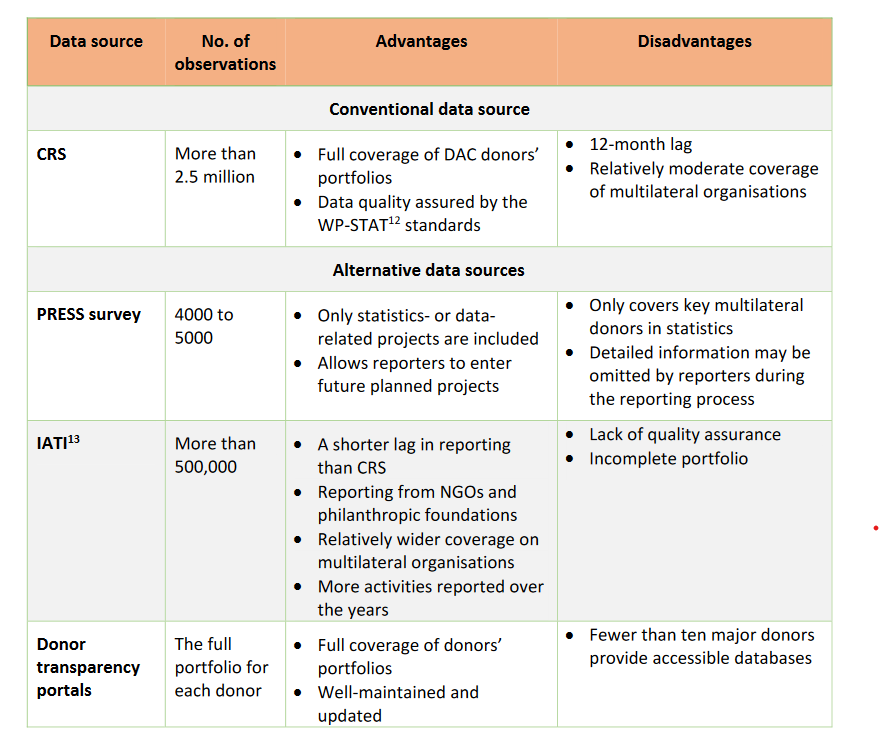

# Monitoring funding to statistics with reduced reporting lag

## What is the reporting lag?

The workflows for combining the two main data sources of PRESS are described in Fig. \@ref(fig:reporting-lag).

One key step when merging the PRESS data, reported by both donors and implementors, with the CRS
data is avoiding duplication in a donor‐implementor‐recipient funding flow. To achieve this, the
projects are examined against their unique identifier in both sources. The projects reported by
implementers (mostly from the PRESS survey) are not counted as contribution of the reporting
agencies. These projects are counted as projects by the donor agencies, after duplication checks were
applied when merging the projects reported by implementers and the projects reported by donors.
As the data and final report of PRESS depend in large part on the CRS database, which has a 12‐months
lag in coverage, the previous editions of PRESS did not capture timely donor financial flows to
statistics, leading to a structural lag in reporting.

```{r reporting-lag, echo=FALSE, fig.align="center", fig.cap = "How the lag in the CRS data led to a lag in previous rounds of PRESS.", }
knitr::include_graphics("./images/reporting_lag.png")
```

This lag meant that in its previous format, PRESS could not provide timely information for partners in
data and statistics, including:

  - Nowcasting the funding to statistics
  
  - Forecasting funding to statistics

Hence, despite the many improvements in PRESS over the years, the lack of timely aid reporting is a
persistent concern among its primary users, especially development aid providers. With a growing
interest in supporting data and statistics, there is an increasing demand for timely data to plan
activities and projects and coordinate development co‐operation efforts. This issue has become
particularly urgent in light of the coordinating efforts to fund the Cape Town Global Action Plan for
Sustainable Development Data (CT‐GAP),^[See https://unstats.un.org/sdgs/hlg/Cape‐Town‐Global‐Action‐Pl] as well as in the context of a diverse data ecosystem comprising new actors.

PARIS21 addressed this request in its 2019 annual meeting by introducing the concept of a
methodology extension. While the PRESS methodology will still be used to report information until 18
months before the publication, the methodology extension will provide stakeholders with PRESS‐like
information on more recent periods, therefore reducing the reporting lag significantly. This concept
became more relevant in 2020, when the development co‐operation community had to face the
challenges that arose due to the COVID‐19 pandemic in national statistical systems (PARIS21, 2020a)
and funding to data by domestic and external stakeholders (PARIS21, 2020b).


## Estimating up‐to‐date support to statistics using CRS {#estimating-using-CRS}

While the previous PRESS (from 2008 to 2019) captured the support to data and statistics by looking
at global **commitments**^[A firm obligation, expressed in writing and backed by the necessary funds, which is undertaken by an official
donor. It provides specified assistance to a recipient country or a multilateral organisation. Bilateral
commitments are recorded in the full amount of the expected transfer, irrespective of the time required for the
completion of disbursements. Commitments to multilateral organisations are reported as the sum of (i) any
disbursements in the year reported on, which have not previously been notified as commitments, and (ii)
expected disbursements in the following year.] 
to statistics, the annual **disbursements**^[The release of funds to or the purchase of goods or services for a recipient; by extension, the amount spent. Disbursements record the actual international transfer of financial resources, or of goods or services valued at
the cost to the donor. In the case of activities conducted in donor countries, such as training, administration, or
public awareness programmes, disbursement is assumed to have occurred when the funds have been
transferred to the service provider or recipient. These may be recorded as gross (the total amount disbursed
over a given accounting period) or net (the gross amount, less any repayments of loan principal or recoveries
on grants received during the same period). It can take several years to disburse a commitment.]
received by a certain country are also informative for donors and countries when planning their activities, especially those short‐term
activities financed by a donor’s annual or biannual budget. Leveraging this additional variable allows
for the estimation of funding to data and statistics received by countries in the current and coming
years while still using the same base data, i.e., the CRS and PRESS surveys (and many other data
sources on development aid, see section 3), which include both variables for each project.

Looking at disbursements instead of commitments to estimate the support to data and statistics has
two distinct advantages:

  1. Disbursements capture the actual release of funds, so are more useful for donor planning purposes.
    
  2. It can take several years to disburse a commitment and some commitments are never
    disbursed. Hence, by design, there are more data points available on disbursements than
    commitments over the same time period. The additional data on disbursements allows for 
    better understanding of financing patterns and donor behaviour, leading to more robust data analysis.
    
This availability of more data points enables us to estimate support to statistics in the current year
(nowcasting) through robust regression analysis. It also provides more substantial evidence of funding
trends in the coming years (forecasting). The following sub‐sections will focus on how to arrive at
these estimates.


### Nowcasting: using commitments to predict current disbursements

Given that CRS has a lag of 12 months for reporting both disbursements and commitments, one way
we can estimate support to statistics disbursed in the current year is by looking at the relationship
between the two variables. The literature on aid predictability indicates that these two variables may
be closely related over time. A 2013 study examining aid predictability based on CRS data also shows
that commitments have a significant impact on disbursements five years after they were made
(Hudson, 2013).

For most development projects reported to the CRS and the PRESS survey, both commitment and
disbursement data are reported. Even when these variables are not directly reported, however, the
missing value can usually be imputed.^[For example, the amount for technical support projects that do not have direct monetary transfers can be
replaced by a cost estimate by the provider. In cases where the disbursement information is missing, the
estimated disbursement amount can be calculated by dividing the unspent commitment amount using the
number of years left before the expected end date]

Using these two variables, PARIS21 has developed a simple linear regression model to estimate the
funding from donors based on historical data at activity level. Regression analysis was conducted to
predict current disbursements based on reported commitments, captured by
$Average\_Annual\_Spending$.

\begin{align}
Disbursement &= Average\_annual\_spending \cdot k + d \\

\text{where} ~~~~ Average\_annual\_spending &= \text{Total Project Commitments}/number\_of\_years
\end{align}


k is the regression coefficient and d is the error term. The number of years is the difference between
the start date and end date of a reported activity. Reported dates are used for activities with missing
value in those two variables. The analysis used the most recently accessible data from the CRS^[See https://stats.oecd.org/DownloadFiles.aspx?DatasetCode=CRS].

This model shows a correlation between disbursements and average spending. Average annual
spending is calculated based on the assumption that commitment without a detailed plan for
disbursement will be distributed evenly by year, from the expected start year to the end year of the
project.


```{=latex}
\begin{tabular}{c|c c c c}
 & Estimate & Std. Error & t value & Pr(>|t|) \\
\hline
(Intercept) & 38.455 & 8.04901 & ‐4.778 & 0.0139*\\
$Average\_Annual\_Spending$ & 0.87461 & 0.05191 & 12.997 & 0.0456*\\
\end{tabular}
```
          
                               Estimate     Std. Error    t value     Pr(>|t|) 
------                        -------       ---------      -------   ---------
(Intercept)                    38.455          8.04901      ‐4.778     0.0139*
$Average\_Annual\_Spending$   0.87461          0.05191      12.997     0.0456*

Table: (\#tab:regression-table) Regression table from the analysis


The analysis of CRS data shows a significant correlation (90%) between disbursements and
commitments each year. The value of k and the predictability of the model vary depending on the
reporting pattern of each donor. For example, while the commitment numbers reported by most
donors each year are usually higher than disbursements (Fig. \@ref(fig:commitments-CRS) on the left), this is reversed in the case
of a few donors (Fig. \@ref(fig:commitments-CRS) on the right)^[This particular reverse correlation can be explained by different factors. Firstly, the financial crisis impacted the continuity of some donors’ ODA flow more than others. The significant variation of the exchange rate or inflation
rate of a donor could also lead to a sudden change in the converted constant value of aid. In addition, some
donors tend to make more long‐term commitments than others, resulting in a distribution of disbursements
over a long period of time, even after the donors had significantly reduced their overall international aid
package].

```{r commitments-CRS, echo=FALSE, fig.align="center", fig.show='hold', out.width="49%", out.height="20%", fig.cap = "Disbursements vs commitments reported in CRS (all donors) on the left. On the right, disbursements vs commitments in the CRS reported by the UK.", }
knitr::include_graphics(c("./images/commitments_disbursements_CRS.png", "./images/commitments_disbursements_UK.png"))
```

Using the above method, PARIS21 was able to nowcast the funding to statistics in years that the most
recent CRS data yet to cover. For instance, although the CRS data available in early 2020 only includes
full coverage of official aid until 2018, the nowcast is able to provide information on aid to statistics
including 2019 and 2020. This is because the stable relationship between average annual spending
and commitments is leveraged, which allows us to estimate the 2019 and 2020 disbursement values,
from the 2018 reported commitment values.

As a result, for the first time, the 2020 edition of PRESS presented information on funding to data and
statistics up to 2019, as opposed to two years prior as in editions including and before PRESS 2019.^[Due to the disruptive effect of the COVID‐19 pandemic on the predictability of the model, the nowcasting results for 2020, although produced, were not presented in the PRESS 2020 report.]


### Forecasting: anticipating future funding

The predictability of disbursements and commitments used for nowcasting funding to statistics
decreases greatly after the current year, since, for example, many projects which commenced in 2017
will end in 2020. However, this lack of predictability can be partially mitigated by the creation of a
forecasting model based on a few well‐informed assumptions, leveraging past PRESS data and
PARIS21’s institutional knowledge on support to statistics for over two decades. These assumptions,
which can lead to better forecasting quality, are described below:

  1. **Continuation of certain long‐standing projects**: We can assume that large projects such as
the support to the Demographic Health Survey driven by USAID, IMF’s national and regional
training on economic statistics, and the World Bank’s programme on statistical development
will remain stable in the near future. Significant changes on these programmes are also easier
to target and detectable. These projects are generally stable and attract similar spends each
year. Likewise, the upcoming censuses or major surveys in low‐income countries are expected
to be funded partially by donors.^[The COVID‐19 pandemic has brought great uncertainty to this assumption, especially for censuses planned
to take place between 2020 and 2021. Although funding for most censuses has been secured, many countries
have diverted their national budget to other, more urgent matters (CCSA, 2020) (UNFPA, 2020), resulting in
the postponement of external funding] This information accounts for nearly half of the total
amount for data and statistics. Confirmation from donors of the continuation of these projects
can further improve the accuracy of this analysis.

  2. **Termination or reduction of funding for certain projects**: We can also anticipate the
termination or reduction for funding tied to a project based on its specific nature. For instance, 
the support for censuses is a one‐off disbursement and will not reoccur until the next census
round. Similarly, if a country become no longer eligible for ODA, graduate from IDA’s borrower
list or becomes an upper‐middle‐income country, it is then expected to receive a lower ODA
grant and become ineligible for some loans. In those cases, support for statistics might be
affected disproportionally, given its low priority.

It is also crucial to state that these predictions can only be accurate if the following additional
assumptions are met:

  - Development aid providers maintain their current levels of effort
  - Existing programmes continue to run
  - Commitments are fully disbursed
  - There is a response to prioritised needs such as censuses
  
The estimation is also limited if donors agencies publishing the new initiatives with a lag. The
predictability of both nowcast and forecast on funding to data and statistics also relies on aid providers
committing to maintaining the transparency and timeliness of their aid data. The forecasting looks at
contribution until $n+2$, given most international organisations’ work plan don’t go beyond that
horizon.

Due to the uncertainty caused by the COVID‐19 pandemic, the forecasting results from this
methodology were not presented in PRESS 2020. These will appear in the future PARIS21 publications
once more evidence becomes available.

In sum, the forecasting estimates should be interpreted with significant caution even if the above
model indicates a relative increase in the coming years. According to many historical estimates, the
funding gap for data and statistics (i.e. to find the entire CT‐GAP) is far from being closed. This gap is
likely to be exacerbated by the effects of the ongoing COVID‐19 crisis in large parts of the globe

## Expanding the PRESS database

### Exploring alternative data sources for aid flows on statistics

Apart from nowcasting and forecasting disbursements to statistics from PRESS data, another way to
address the structural lag in aid‐flow reporting can be by attempting to remedy the root cause of the
problem – the dependency on the CRS database – and searching for more timely information in
alternative data sources. PARIS21 has identified three main (types) of alternative data sources,
outlined below:

#### The International Aid Transparency Initiative (IATI) {-}

The IATI datastore is the largest alternative database outside of OECD‐DAC data for official
development assistance. With more than 100 donors reporting to this database, IATI has a much
shorter lag than CRS. It also covers more projects by philanthropic foundations. The COVID‐19
pandemic and the rising need for coordination has also incentivised aid providers to report to IATI
with less delay. However, IATI data suffer from a lack of quality assurance and inconsistency within
the dataset. Although it uses a similar data structure as the CRS, the reported projects in IATI may not
include important granular information, such as the project description. Furthermore, as many donors
only committed to reporting to IATI after 2014, the lack of historical data for drawing time series also
affects its ability to forecast.

#### Donors’ transparency portals {-}

In recent years, global donors have strengthened their efforts in aid transparency. Many donors have
developed online data portals or uploaded online datasets to share information on their aid projects,
especially the major donors in statistics such as the World Bank, UNDP, USAID, FCDO, IDRC, etc. These
datasets usually have a similar density of information as the CRS data and are usually updated more
frequently than CRS. However, the majority of donors still lack appropriate portals and public datasets.
Furthermore, merging these different datasets is possible, but time intensive.

PARIS21 has been exploring these data sources since 2019 and has accumulated knowledge over this
period. For example, the USAID dataset helped PRESS 2019 to identify the USA’s support to statistics
for the first time; in particular, its effort with the Demographic Health Survey (DHS). PARIS21 has also
established a methodology for merging and harmonising the aforementioned datasets. The
methodology maps variables in different datasets against each other and uses internal project
identifiers to avoid duplications.

#### Multilateral donors’ prospective reporting to the PRESS surve {-}

The online PRESS survey (introduced in Sec. \@ref(P21-online-survey)) includes a feature that allows donors to report on
future projects. Since many donors have a biannual programme of work, in each year’s survey, they
are encouraged to provide information on the project they have planned or committed to in the near
future. In the survey, donors can verify, edit, and cancel future projects in the next round of reporting.
However, previous editions of PRESS did not fully reflect future projects due to the report’s focus on
accuracy. However, these future projects could still contain valuable information to assist in the
projection of aid flows. The methodology developed by PARIS21 leverages these projects as an
underutilised existing data source that may not reflect completely on the activities from donors.
Nevertheless, it is useful for nowcasting funding.

The comparison of the above data sources can be found in \@ref(fig:data-sources). As another important data
source in the area of data and statistics, the Eurostat’s donor survey is analysed in Box 2.


```{r data-sources, echo=FALSE, fig.align="center", fig.cap = "Comparison of data sources.", out.width = "80%"}

```

:::: {.emphbox data-latex=""}
::: {.center data-latex=""}
**Box 2**
:::

The annual Donor Survey by Eurostat aims to provide an overview of statistical projects in the
respective countries to allow for better planning of assistance in the field of statistics, to benefit
from acquired experience, and to avoid overlap. The survey is distributed to donor countries,
international organisations, and the recipients (mostly Eurostat member states or partner
states) of support to data and statistics.

According to the report of the 2020 round, the Donor Survey’s main objectives included:

  - facilitating better planning and prioritisation of assistance, especially amongst the donors;
      
  - increasing transparency/visibility for donors and implementing agencies and potentially serving as an “audit” document for beneficiaries;
      
  - providing the beneficiaries with a broad overview of the areas in which they are receiving support, also at regional level, and prioritising their future needs;
      
  - benefitting and learning from the experiences, good practices, and shortcomings of other projects;
      
  - facilitating a dialogue between beneficiaries, donors, and implementing agencies.
  
At donor country level and on the donors’ side, respondents to the Donor Survey overlap with
CRS. However, the CRS reporting is coordinated by one national focal point, while the Donor
Survey questionnaire is distributed to both the aid agencies and national statistics offices who
provide technical support. However, the Donor Survey data set does not have a good system to
harmonise the data from the two sides, nor does it contain the program identifiers, which
are essential to avoid duplication when combining information with other sources. Unlike the
development of financing databases, the Donor Survey also lacks a mechanism to update
previous years’ reported projects. Coverage of the survey is also not comprehensive enough to
provide additional values to the alternative data sources identified in this document.
:::::

### Addressing gaps in the alternative data sources

To take advantage of the alternative data sources, PARIS21 combined the information from CRS and
online surveys with these alternative data sources to create a more up‐to‐date, harmonised database
on funding for data and statistics. However, this means that two important problems must be
addressed, described below:

  1. **The completeness problem**: A common weakness of the alternative data sources,
compared with CRS, is their incomplete coverage. This is especially apparent in IATI where,
unlike CRS, donors may not report their full portfolio, leading to a lack of comprehensive
information (a “vertical” information gap i.e. multiple donors but incomplete project
information for individual donor). Furthermore, the CRS uses a more “centralized” reporting
system for each donor country, whereby information from different agencies providing ODA
is gathered under one entity before reporting to CRS as a whole. The IATI, on the other hand,
allows different agencies in a single donor country to report their data separately. This implies
different reporting patterns for different agencies based on their capacity to do so regularly,
and a lack of overall coordination.

  2. **The coverage problem**: CRS contains information from over 100 donors. On the other
hand, donor transparency portals suffer from a “horizontal” problem, i.e., they usually have
complete coverage and contain the full portfolio, but fewer than ten major donors provide
access to such open and easy‐to‐use databases.

PARIS21 has mitigated the horizontal and vertical problems in alternative data sources by harmonising
and linking these databases. The alternative sources provide a wider coverage, while the combination
of CRS, IATI and donors’ databases enhance the completeness of the data. The final data set used in
the analyses combines the alternative data sources and PRESS data using project IDs and other
identifiers. As a caveat, however, the total number of projects included in the alternative sources still
only represents 40% of all number of projects reported in the CRS.

The advantage of using such data sources, such as the timeliness and inclusion of philanthropic
foundations, makes them a useful extension of PRESS data, especially when trying to solve the lag
issue. However, their weaknesses imply that they are not a substitute for CRS or, by extension,
conventional PRESS analysis.


### Linking the alternative sources: the new harmonised database

The next step in leveraging the independent alternative data sources described above is to link them
with PRESS data and create a new harmonised database of disbursements for data and statistics **at
project level.**

Using disbursements as the primary variable to determine the support to statistics is even more
beneficial at this stage, and data on annual disbursements is adequately available in most of the
sources considered above. The activity‐based CRS data, for example, contain nowcasting/forecasting
regressions on this new data set by Simon etc. to see value add and/or consistency of our findings!
Should we present this? I think you did it and found little to no change right? disbursement information
for more than 98% of the projects. Similarly, the PRESS survey for multilateral donors provides specific
information on disbursement plans (though it is project‐based). The donors’ transparency portals are
also expenditure/disbursement based.

However, the IATI database is weaker in this regard: it contains an unusually high percentage of
negative commitments or disbursements. For example, data downloaded from the IATI database in
2018 contained negative value commitments or disbursements in 18% of projects reported^[Based on data collected in 2019, the future improvements of the IATI database have resolved this issue.]. In
comparison, less that 1% of activities reported in CRS has negative value, mostly associated with loan
repayments and correction of previous entries, i.e. not a database error.

For the harmonised database, the missing disbursement values were imputed based on the
assumption that the commitments were distributed evenly from the start date to the end date of the
project. The negative projects in IATI were corrected or removed by cross‐validating against CRS. The
duplicated projects were removed based on project identifiers. Consultations with several multilateral
donors were conducted to ensure the validity of the final data.

Fig. \@ref(fig:ePRESS) presents an example of how the new harmonised dataset looks after linking the different
sources. For the 15,312 projects in the new datasets, 54% of disbursement activities come from the
CRS data, compared with over 73% in the earlier dataset used for PRESS. In the new dataset, the PRESS
survey accounts for 27% of projects, while IATI data and donor databases account for 19% of projects.
By filtering through the data using recipient country and year, donors can already observe the
upcoming funding received by a country for statistical development. It is then easier for them to
identify funding gaps in prioritised areas. Hence, the new harmonised database can achieve better
diversification of data sources and reduce the dependence on CRS.

```{r ePRESS, echo=FALSE, fig.align="center", fig.cap = "Comparison of PRESS and the new harmonised database for the share of projects in the final data sets, by sources of data, 2016‐2018.", }
knitr::include_graphics("./images/ePRESS.png")
```


## Bringing them together – nowcasting and forecasting with the new harmonised database

PARIS21 applied the same model on nowcasting and forecasting support to statistics (disbursements)
but based on the new harmonised database, linking PRESS data with the aforementioned alternative
sources. The main findings of this approach were similar to those based on CRS estimations: there is
no indication of a systematic increase in funding to statistics in the current or coming years.