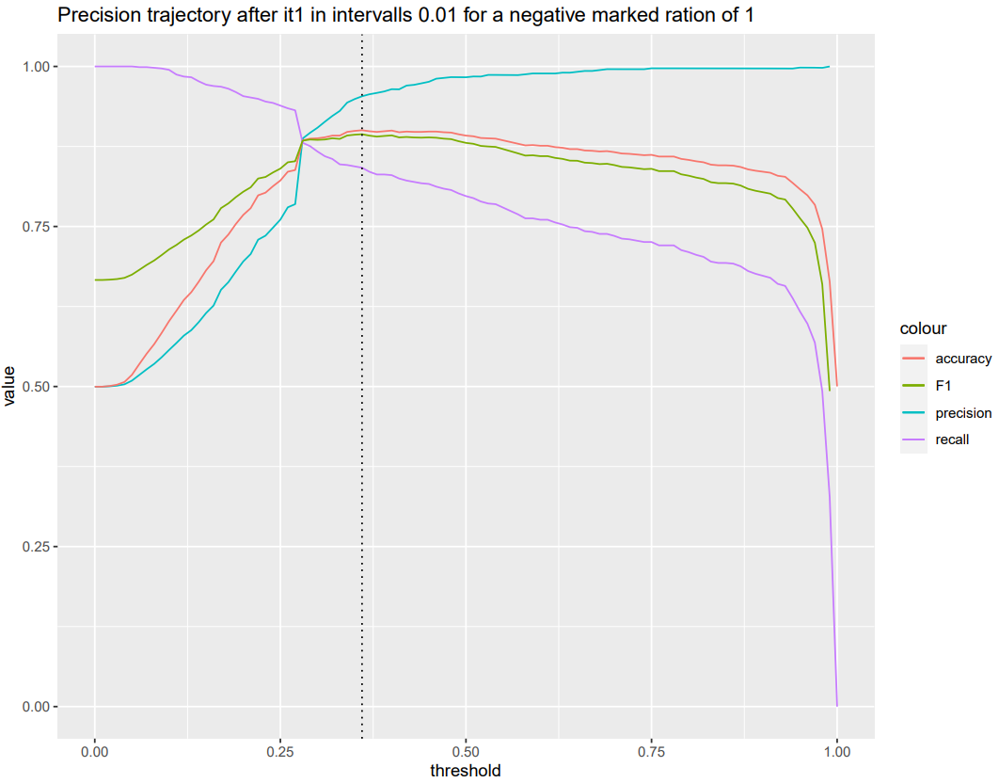
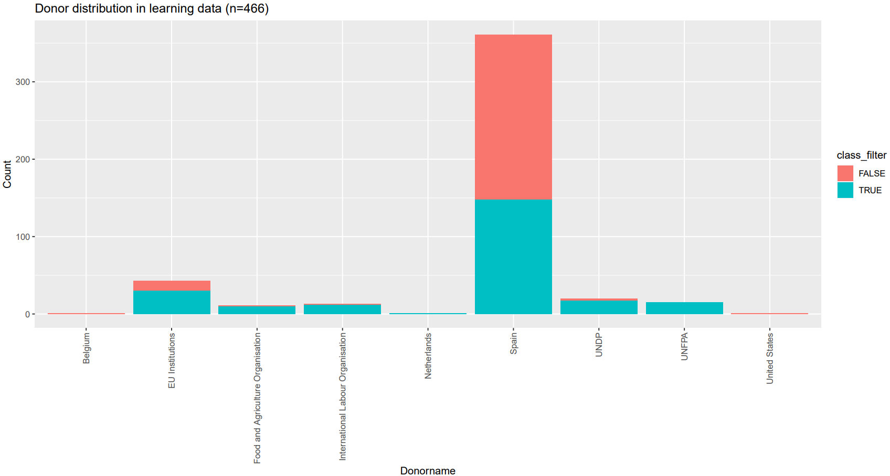
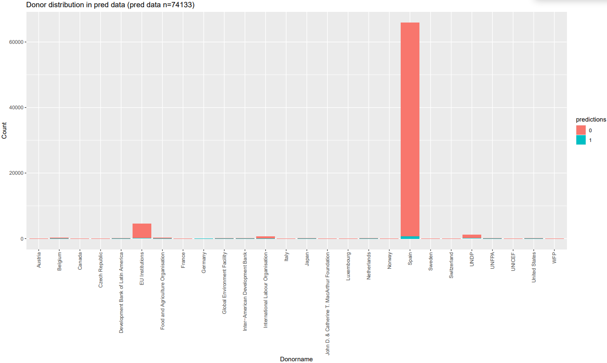

# (APPENDIX) Appendix {-} 

# Appendix - Keyword lists {#Appendix-A}

## English {-}

```{r Appendix-A-en, echo=FALSE, message=FALSE, warning=FALSE, fig.pos = "!H"}
library(tidyverse)
library(kableExtra)
lang <- "en"
list_keywords_stat <- read_lines(paste0("./Data/Final keyword lists/statistics_reduced_", lang, ".txt"), skip_empty_rows = TRUE)  %>% trimws()
demining_small_arms <- read_lines(paste0("./Data/Final keyword lists/demining_small_arms_", lang, ".txt"), skip_empty_rows = TRUE)  %>% trimws()
list_acronyms <- read_lines(paste0("./Data/Final keyword lists/statistics_reduced_acronyms_", lang, ".txt"), skip_empty_rows = TRUE)  %>% trimws()
max <- max(length(list_keywords_stat), length(demining_small_arms), length(list_acronyms))
keywords <- data.frame(statistical_keywords = c(list_keywords_stat, rep("", max - length(list_keywords_stat))),
                          demining_keywords = c(demining_small_arms, rep("", max - length(demining_small_arms))),
                          acronyms = c(list_acronyms, rep("", max - length((list_acronyms)))))
knitr::kable(keywords[1:45,], row.names = F)%>% 
  kable_styling(font_size = 10, latex_options = "HOLD_position")
knitr::kable(keywords[45:nrow(keywords), ], row.names = F) %>% 
  kable_styling(font_size = 10, latex_options = "HOLD_position")
```
## French {-}

```{r Appendix-A-fr, echo=FALSE}
lang <- "fr"
list_keywords_stat <- read_lines(paste0("./Data/Final keyword lists/statistics_reduced_", lang, ".txt"), skip_empty_rows = TRUE)  %>% trimws()
demining_small_arms <- read_lines(paste0("./Data/Final keyword lists/demining_small_arms_", lang, ".txt"), skip_empty_rows = TRUE)  %>% trimws()
list_acronyms <- read_lines(paste0("./Data/Final keyword lists/statistics_reduced_acronyms_", lang, ".txt"), skip_empty_rows = TRUE)  %>% trimws()
max <- max(length(list_keywords_stat), length(demining_small_arms), length(list_acronyms))
keywords <- data.frame(statistical_keywords = c(list_keywords_stat, rep("", max - length(list_keywords_stat))),
                          demining_keywords = c(demining_small_arms, rep("", max - length(demining_small_arms))),
                          acronyms = c(list_acronyms, rep("", max - length((list_acronyms)))))
knitr::kable(keywords[1:45,], row.names = F)%>% 
  kable_styling(font_size = 10, latex_options = "HOLD_position")
knitr::kable(keywords[45:nrow(keywords), ], row.names = F) %>% 
  kable_styling(font_size = 10, latex_options = "HOLD_position")
```

## Spanish {-}

```{r Appendix-A-es, echo=FALSE}
lang <- "es"
list_keywords_stat <- read_lines(paste0("./Data/Final keyword lists/statistics_reduced_", lang, ".txt"), skip_empty_rows = TRUE)  %>% trimws()
demining_small_arms <- read_lines(paste0("./Data/Final keyword lists/demining_small_arms_", lang, ".txt"), skip_empty_rows = TRUE)  %>% trimws()
list_acronyms <- read_lines(paste0("./Data/Final keyword lists/statistics_reduced_acronyms_", lang, ".txt"), skip_empty_rows = TRUE)  %>% trimws()
max <- max(length(list_keywords_stat), length(demining_small_arms), length(list_acronyms))
keywords <- data.frame(statistical_keywords = c(list_keywords_stat, rep("", max - length(list_keywords_stat))),
                          demining_keywords = c(demining_small_arms, rep("", max - length(demining_small_arms))),
                          acronyms = c(list_acronyms, rep("", max - length((list_acronyms)))))
knitr::kable(keywords[1:45,], row.names = F)%>% 
  kable_styling(font_size = 10, latex_options = "HOLD_position")
knitr::kable(keywords[45:nrow(keywords), ], row.names = F) %>% 
  kable_styling(font_size = 10, latex_options = "HOLD_position")
```

## German {-}

```{r Appendix-A-de, echo=FALSE}
lang <- "de"
list_keywords_stat <- read_lines(paste0("./Data/Final keyword lists/statistics_reduced_", lang, ".txt"), skip_empty_rows = TRUE)  %>% trimws()
demining_small_arms <- read_lines(paste0("./Data/Final keyword lists/demining_small_arms_", lang, ".txt"), skip_empty_rows = TRUE)  %>% trimws()
list_acronyms <- read_lines(paste0("./Data/Final keyword lists/statistics_reduced_acronyms_", lang, ".txt"), skip_empty_rows = TRUE)  %>% trimws()
max <- max(length(list_keywords_stat), length(demining_small_arms), length(list_acronyms))
keywords <- data.frame(statistical_keywords = c(list_keywords_stat, rep("", max - length(list_keywords_stat))),
                          demining_keywords = c(demining_small_arms, rep("", max - length(demining_small_arms))),
                          acronyms = c(list_acronyms, rep("", max - length((list_acronyms)))))
knitr::kable(keywords[1:45,], row.names = F)%>% 
  kable_styling(font_size = 10, latex_options = "HOLD_position")
knitr::kable(keywords[45:nrow(keywords), ], row.names = F) %>% 
  kable_styling(font_size = 10, latex_options = "HOLD_position")
```

# Appendix - Performance tests {#Appendix-B}

```{r Appendix-B-precision, echo = FALSE, message=FALSE, fig.align='center', fig.cap='Precision, accuracy, recall and F1 score for the English classification', out.width='100%'}

```

```{r Appendix-B-es-donor-learning, echo = FALSE, message=FALSE, fig.align='center', fig.cap='Donor distribution of the learning data for the Spanish classification.', out.width='100%'}

```

```{r Appendix-B-es-donor-pred, echo = FALSE, message=FALSE, fig.align='center', fig.cap='Donor distribution of the prediction data for the Spanish classification.', out.width='100%'}

```