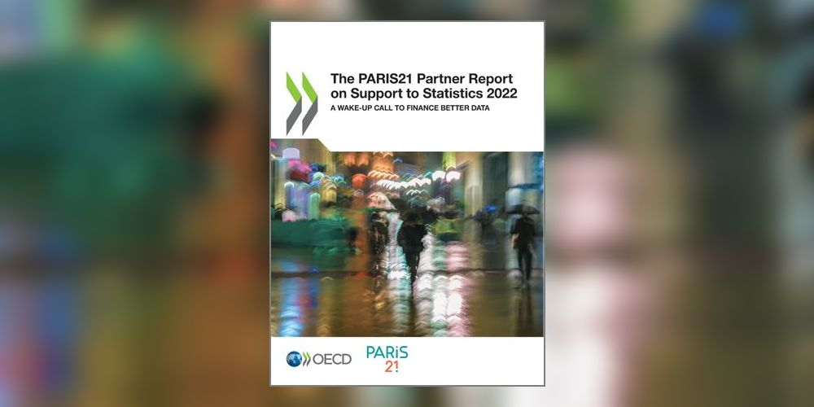

--- 
title: "Measuring and estimating funding to data and statistics"
description: "Technical note for the Partner Report on Support to Statistics"
date: "`r paste0('Version 2 (updated on ', format(Sys.time(), '%B %Y'), ')')`"
site: bookdown::bookdown_site
cover-image: PRESS_2022_cover.png
favicon: P21_icon.ico
header-includes:
  - \usepackage{caption}
  - \usepackage{array}
  - \usepackage{float}
  - \hypersetup{colorlinks = true, urlcolor = cyan, citecolor = black, menucolor = black, anchorcolor = black, linkcolor=black}
bibliography: [Bibliography.bib]
nocite: '@*'
link-citations: yes
keywords:
  - PRESS
  - Statistics
  - 2022
---


# Why this methodology note? {-}

PARIS21 produces the Partner Report on Support to Statistics (PRESS) annually to report on trends in 
support  to  statistics.  The  methodology  is  applied  retrospectively  for  all  previous  years  to  ensure comparability over time. This document presents the methodology used in [PRESS 2022](https://www.oecd-ilibrary.org/sites/c3cfb353-en/index.html?itemId=/content/publication/c3cfb353-en). 

<br />

```{r front-cover, echo=FALSE, fig.align="center", out.width="100%" }

```
